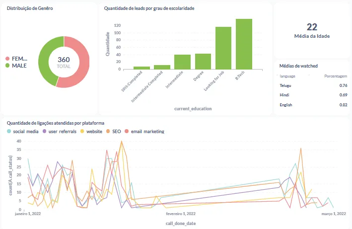

                                                         📊 Projeto de Análise de Leads - EdTech

📌 Objetivo
Este projeto tem como objetivo analisar o comportamento e as características dos leads gerados para uma empresa EdTech, com foco na aquisição de novos usuários e no aumento da taxa de conversão. A análise busca fornecer insights que ajudem a equipe de negócios a desenvolver estratégias mais eficazes de prospecção, abordagem e retenção de leads.

🧠 Pergunta de Negócio
Como os leads se comportam em relação a gênero, escolaridade, origem, interações e interesse nas demonstrações, e como esses fatores influenciam no sucesso da aquisição de novos usuários?

📁 Base de Dados
Foram utilizadas 5 tabelas extraídas do Metabase:

Tabela	                                                    Descrição
leads_basic_details	                                        Detalhes demográficos e educacionais dos leads
sales_managers_assigned_leads_details	                    Informações de atribuição de leads para gerentes de vendas
leads_interaction_details	                                Registro das interações e ligações com os leads
leads_demo_watched_details	                                Dados sobre sessões de demonstração assistidas pelos leads
leads_reasons_for_no_interest	                            Motivos declarados para desinteresse em diferentes estágios do funil

📈 Visões do Dashboard e Queries SQL

✅ Etapa 01: Distribuição de Gênero (Gráfico de Pizza)
Objetivo: Ver proporção de leads do sexo feminino e masculino

sql
SELECT
  Gender,
  COUNT(*) AS quantidade
FROM
   leads_basic_details
GROUP BY
  Gender
ORDER BY
  quantidade DESC;

✅ Etapa 02: Média da Idade (Cartão)
Objetivo: Obter a idade média dos leads

sql
SELECT
  AVG(Age) AS media_idade
FROM
  leads_basic_details;

✅ Etapa 03: Leads por Grau de Escolaridade (Gráfico de Barras)
Objetivo: Contar leads agrupados por grau de instrução

sql
SELECT
    current_education,
    COUNT(*) AS quantidade
FROM leads_basic_details
GROUP BY 
current_education
ORDER BY 
quantidade;

✅ Etapa 04: Média de Percentual Assistido por Idioma (Tabela)
Objetivo: Exibir idiomas com média de visualização acima de 50%

sql
SELECT 
    language,
    AVG(watched_percentage) AS average_watched_percentage
FROM 
    leads_demo_watched_details
WHERE 
    watched_percentage > 0.5
GROUP BY 
    language
ORDER BY 
    average_watched_percentage DESC;

✅ Etapa 05: Ligações Atendidas por Plataforma (Gráfico de Linhas)
Objetivo: Mostrar a evolução de chamadas atendidas por canal de aquisição

sql
SELECT
    DATE(i.call_done_date) AS call_date,
    l.lead_gen_source AS platform,
    COUNT(*) AS total_calls
FROM leads_basic_details l
JOIN leads_interaction_details i
  ON l.lead_id = i.lead_id
WHERE i.call_status = 'successful'
GROUP BY
    DATE(i.call_done_date),
    l.lead_gen_source
ORDER BY call_date, platform;

## 📸 Visão do Dashboard

  

🧮 Métricas e Indicadores
Métrica	                                       Descrição
Total de Leads	                               Contagem total de leads cadastrados
Distribuição de Gênero	                       Proporção de leads do sexo feminino e masculino
Média de Idade	                               Cálculo da idade média dos leads
Leads por Grau de Escolaridade	               Agrupamento por nível educacional atual
Leads por Plataforma de Origem	               Volume de ligações recebidas por canal de aquisição
Média de Percentual Assistido	               Percentual médio de demonstração assistida por idioma
Evolução de Chamadas Atendidas	               Número de chamadas com sucesso ao longo do tempo

🧠 Insights de Negócio

A maioria dos leads está no nível de Bacharelado, indicando público com forte base educacional.

22 anos é a idade média, revelando um público jovem e propenso a cursos online.

Plataformas como redes sociais e indicações geram grande volume de ligações bem-sucedidas.

A maior parte dos leads assiste às demonstrações em Telugu, mas o potencial de crescimento está em Inglês, que tem baixa média de engajamento.

A análise temporal de ligações ajuda a identificar melhores períodos para contato e impacto de campanhas específicas.

🛠️ Tecnologias Utilizadas
Ferramenta	                Uso
Metabase	                Consultas SQL e construção do dashboard
SQL	                        Filtragem, agrupamentos, cálculos e ordenações
Notion / Documentação	    Planejamento analítico e organização dos dados